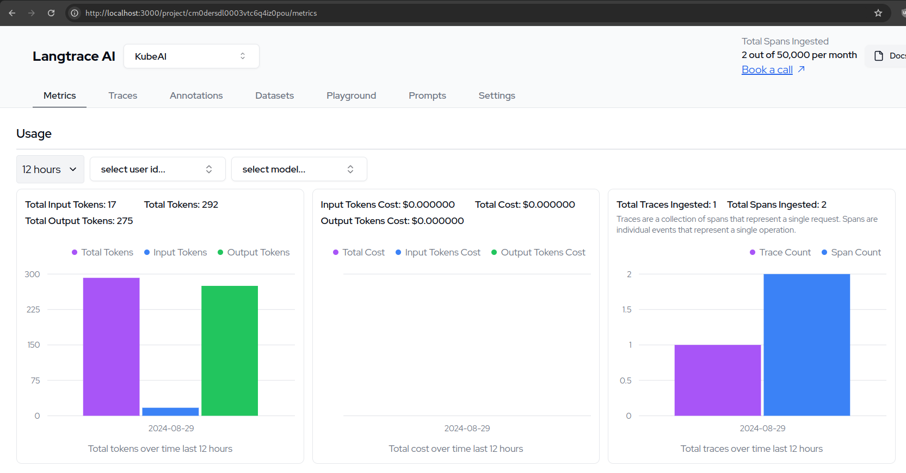

# Deploying KubeAI with Langtrace

Langtrace is an open source tool that helps you with tracing and monitoring
your AI calls. It includes a self-hosted UI that for example shows you the
estimated costs of your LLM calls.

[KubeAI](https://github.com/substratusai/kubeai) is used for deploying LLMs with an OpenAI compatible endpoint.

In this tutorial you will learn how to deploy KubeAI and Langtrace end-to-end.
Both KubeAI and Langtrace are installed in your Kubernetes cluster.
No cloud services or external dependencies are required.

If you don't have a K8s cluster yet, you can create one using [kind](https://kind.sigs.k8s.io/) or [minikube](https://minikube.sigs.k8s.io/docs/).
```bash
kind create cluster # OR: minikube start
```

Install Langtrace:
```
helm repo add langtrace https://Scale3-Labs.github.io/langtrace-helm-chart
helm repo update
helm install langtrace langtrace/langtrace
```

Install KubeAI:
```bash
helm repo add kubeai https://substratusai.github.io/kubeai/
helm repo update
cat <<EOF > helm-values.yaml
models:
  catalog:
    gemma2-2b-cpu:
      enabled: true
      minReplicas: 1
EOF

helm upgrade --install kubeai kubeai/kubeai \
    --wait --timeout 10m \
    -f ./helm-values.yaml
```

Create a local Python environment and install dependencies:
```
python3 -m venv .venv
source .venv/bin/activate
pip install langtrace-python-sdk openai
```

Expose the KubeAI service to your local port:
```bash
kubectl port-forward service/kubeai 8000:80
```

Expose the Langtrace service to your local port:
```bash
kubectl port-forward service/langtrace-app 3000:3000
```

A Langtrace API key is required to use the Langtrace SDK. So lets get one
by visiting your self hosted Langtace UI.

Open your browser to [http://localhost:3000](http://localhost:3000), create
a project and get the API keys for your langtrace project.

In the Python script below, replace `langtrace_api_key` with your API key.

Create file named `langtrace-example.py` with the following content:
```python
# Replace this with your langtrace API key by visiting http://localhost:3000
langtrace_api_key="f7e003de19b9a628258531c17c264002e985604ca9fa561debcc85c41f357b09"

from langtrace_python_sdk import langtrace
from langtrace_python_sdk.utils.with_root_span import with_langtrace_root_span
# Paste this code after your langtrace init function

from openai import OpenAI

langtrace.init(
    api_key=api_key,
    api_host="http://localhost:3000/api/trace",
)

base_url = "http://localhost:8000/openai/v1"
model = "gemma2-2b-cpu"

@with_langtrace_root_span()
def example():
    client = OpenAI(base_url=base_url, api_key="ignored-by-kubeai")
    response = client.chat.completions.create(
        model=model,
        messages=[
            {
                "role": "system",
                "content": "How many states of matter are there?"
            }
        ],
    )
    print(response.choices[0].message.content)

example()
```

Run the Python script:
```bash
python3 langtrace-example.py
```

Now you should see the trace in your Langtrace UI. Take a look by visiting
[http://localhost:3000](http://localhost:3000).


