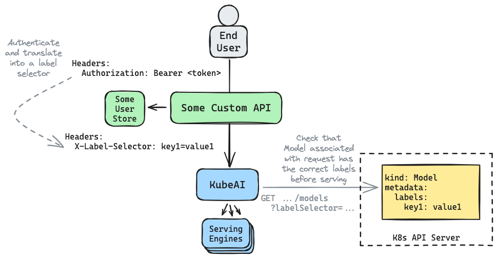

# Auth

The goal of this proposal is to allow KubeAI to be used in a multitenancy environment where
some users only have access to some models.

## Implementation Option 1: Auth Labels

In this implementation, KubeAI has well-known labels that correspond to groups that are allowed to access models.

The KubeAI system is configured to trust a configured header.

```yaml
auth:
  http:
    trustedHeader: X-Auth-Groups
  # Possibly in future: configure Model roles.
  # modelRoles:
  #   user: ["list", "describe", "infer"]
```

The groups associated with a request are passed in a trusted header.

```bash
curl http://localhost:8000/openai/v1/completions \
    -H "X-Auth-Groups: grp-a, grp-b"
```

The groups that are allowed to access a given model are configured as labels on the Model.

```yaml
kind: Model
metadata:
  name: llama-3.2
  labels:
    auth.kubeai.org/grp-a: user
    auth.kubeai.org/grp-c: user
```

## Implementation Option 2: General Labels

**CURRENT PREFERENCE** (Unless there is a reason to introduce auth-specific configuration.)

In this implementation, label selectors are used to filter models. The decision of which labels to use are up to the architects of the system that KubeAI is a part of. These label selectors could be enforced by a server that is an intermediary between KubeAI and the end users.



```bash
curl http://localhost:8000/openai/v1/completions \
    -H "X-Selector: key1=value1"

curl http://localhost:8000/openai/v1/models \
    -H "X-Selector: key1=value1"
```

Models just need to have the labels set.

```yaml
kind: Model
metadata:
  name: llama-3.2
  labels:
    key1: value1
```
